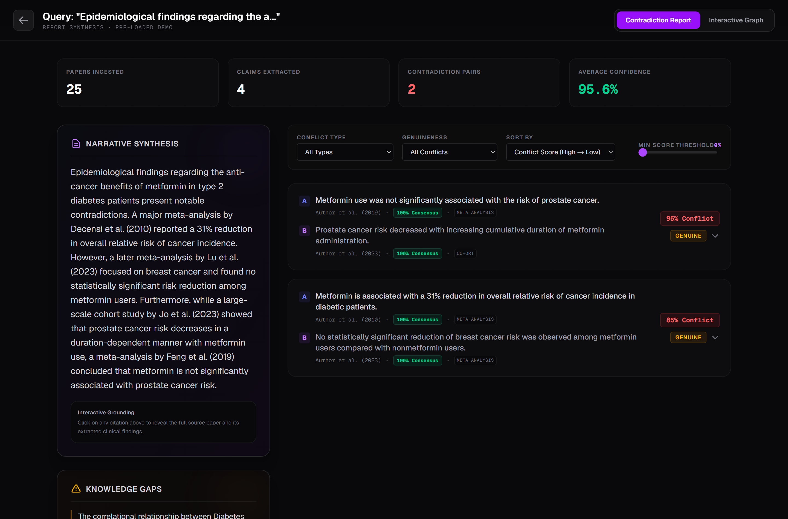
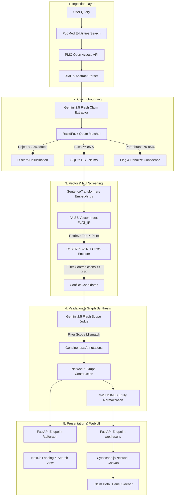

# Research Synthesis & Contradiction Engine (RSCE)

[](https://fastapi.tiangolo.com)
[](https://nextjs.org)
[](https://www.python.org)
[](https://huggingface.co/cross-encoder/nli-deberta-v3-large)
[](https://opensource.org/licenses/MIT)

**Research Synthesis & Contradiction Engine (RSCE)** is an AI-powered meta-research platform designed to ingest clinical literature, extract claims with verbatim quote-level grounding, and map conflicting findings into an interactive, visual claim-evidence network graph.

Clinicians, researchers, and scientific writers are overwhelmed by thousands of newly published papers daily. These publications often present conflicting clinical outcomes due to minor differences in trial protocols, drug dosages, patient demographics, or study designs. RSCE addresses this by parsing literature inputs, running candidates through a local Natural Language Inference (NLI) cross-encoder screening phase, and validating logical contradictions via a scope-aware LLM judge. The end result is a citation-grounded narrative synthesis report alongside an interactive Cytoscape network representation of support and conflict states.



---

## 🌐 Live Demo & Presentation

*   **Live Hosted Demo**: [frontend-rho-ten-33.vercel.app](https://frontend-rho-ten-33.vercel.app) (Next.js frontend on Vercel, FastAPI backend on Railway)
*   **Pre-loaded Topics**: The live demo ships with three seeded analyses (metformin & cancer risk, intermittent fasting & insulin sensitivity, SSRIs & adolescent suicide risk) so the full report and graph are explorable without waiting for a live pipeline run.

---

## 🔍 Core Capabilities

*   **Ingestion & Parsing**: Downloads papers from PubMed E-utilities and, where available, extracts full-text sections (Introduction, Methods, Results, Discussion) from PubMed Central (PMC) Open Access XML — with an Unpaywall + PyMuPDF PDF fallback for open-access articles not in PMC.
*   **Fuzzy Quote Grounding**: Extracts clinical claims and maps them back to the source text using RapidFuzz matching, rejecting hallucinations when the verbatim quote anchor cannot be verified (≥85% pass, 70–85% flagged with halved confidence, <70% discarded).
*   **Vector Retrieval**: Indexes claims into a local FAISS index using Sentence-Transformers (`all-MiniLM-L6-v2`) to retrieve the most similar cross-paper candidate pairs for comparison.
*   **NLI Conflict Screening**: Evaluates candidates using a local DeBERTa-v3 cross-encoder model to compute logical entailment, neutral, and contradiction scores.
*   **Scope-Aware Judgement**: Employs Gemini 2.5 Flash to verify contradiction authenticity, weeding out false positives arising from study designs or population discrepancies (e.g. human trials vs in-vitro mouse models), and classifying each conflict into one of six contradiction types.
*   **Temporal Supersession & Knowledge Gaps**: Programmatically flags when a newer, higher-evidence study supersedes an older one, and surfaces single-source claim topics that have not yet been corroborated or challenged.
*   **Interactive Claim Graph**: Visualizes papers, claims (colored by support/contradict polarity), and normalized MeSH/UMLS entities using Cytoscape.js with force-directed layouts and neighborhood-highlight selection.
*   **Targeted Search & Live Progress**: Optional seed-claim biasing ("find evidence contradicting X"), date-range and journal filters, and real-time pipeline progress streamed to the UI over WebSockets.

---

## 🏗️ System Architecture

The pipeline processes input queries through five distinct stages:



---

## ⚙️ Key Technical Decisions

### 1. Assertion-First Graph Architecture
Rather than indexing papers as flat units of text, RSCE treats individual assertions (claims) as first-class, independent database entities. This allows the graph layout to map clinical outcomes directly to MeSH IDs, revealing clusters of consensus and conflict across entirely different publishers and journals.

### 2. Hybrid Screening + Judgment Pipeline (NLI + LLM)
Running an LLM over all possible pairs of claims in a 25-paper corpus grows quadratically ($O(N^2)$), which is expensive and slow. To keep execution under 2 minutes and cost-effective, RSCE uses a local screening pipeline:
1.  **FAISS** retrieves the top-K most similar cross-paper candidate pairs.
2.  **DeBERTa-v3 NLI** cross-encoder screens pairs locally on CPU in seconds.
3.  **Gemini 2.5 Flash** runs only on the flagged candidates to perform high-precision, scope-aware logic evaluation.

### 3. RapidFuzz Quote-Anchor Verification
To guarantee factual verification, the LLM extraction schema requires returning a `quote_anchor` verbatim substring. We compute a fuzzy partial ratio between this string and the paper body. If it is an exact match (score $\ge 85$), the claim is verified. Paraphrases (score $70-85$) are flagged and penalized, and fabrications ($< 70$) are dropped.

---

## 📊 Evaluation & Benchmarks

The contradiction-screening stage (the local DeBERTa-v3 NLI cross-encoder) is benchmarked against the **SciFact** clinical evidence dataset. Every claim–evidence pair in the SciFact dev set that carries a gold `SUPPORT` or `CONTRADICT` label is scored by the cross-encoder, and a pair is predicted as a contradiction when its contradiction probability meets the configured threshold (`0.7`). Metrics are computed for the `CONTRADICT` (refutes) class over the full dev set ($N = 338$ pairs).

This benchmark is fully reproducible: `make eval-scifact` downloads SciFact, runs the scorer, and writes the confusion matrix to `evaluation/results/`.

| Metric (CONTRADICT class) | Target | Measured |
| :--- | :---: | :---: |
| **Precision** | $\ge 70\%$ | **87.3%** |
| **Recall** | $\ge 55\%$ | **45.1%** |
| **F1-Score** | — | **59.5%** |

> Confusion matrix (N=338, threshold=0.7): **TP=55, FP=8, FN=67, TN=208** — i.e. precision = 55/63, recall = 55/122.

> [!NOTE]
> **Why precision is high but recall is moderate.** The screener is deliberately tuned for a high-precision operating point: it minimizes false conflicts (87.3% precision) at the cost of missing more subtly phrased contradictions, leaving recall just below the 55% target. Recall does tighten further as the contradiction threshold is raised (e.g. ~34% at a strict 0.99 cutoff), so the default 0.7 threshold is the balance used for the figures above. Lifting recall without sacrificing precision (e.g. by fine-tuning the NLI checkpoint on SciFact) is tracked in the roadmap.

**Scope note:** This number measures the NLI *screening* stage in isolation, not the end-to-end pipeline (which adds the LLM scope-judge on top). Claim-extraction quality and citation fidelity are enforced at runtime by the quote-anchor verifier and the citation post-validator (see *Key Technical Decisions*) rather than by a standalone scored benchmark.

---

## 💰 Run Cost Analysis

A typical 25-paper run costs well under **$0.20**. All embedding and NLI inference runs locally, so the only paid calls are to Gemini 2.5 Flash for extraction, judging, and synthesis. The figures below are estimates derived from the per-stage cost constants in `src/config.py`:

*   **Ingestion (PubMed / PMC / Unpaywall APIs)**: Free.
*   **Embedding (`all-MiniLM-L6-v2`)**: $0.00 (local CPU/GPU).
*   **Screening (`deberta-v3-large`)**: $0.00 (local CPU/GPU).
*   **Claim Extraction (Gemini 2.5 Flash)**: ~$0.02 (≈$0.0008/paper × 25 papers).
*   **Contradiction Judging (Gemini 2.5 Flash)**: ~$0.08 (≈$0.008 per candidate pair reaching the judge).
*   **Synthesis Report (Gemini 2.5 Flash)**: ~$0.045 (single narrative-generation call).
*   **Total estimated run cost**: **~$0.10 – $0.18**

---

## 🛠️ Quick Start & Installation

### Prerequisites
*   Python 3.10+
*   Node.js 20.9+ (required by Next.js 16, for frontend)
*   A Gemini API Key (set as `GEMINI_API_KEY`)

### 1. Clone and Install Backend
```bash
# Clone the repository
git clone https://github.com/Laaksh1205/RSCE.git
cd RSCE

# Create virtual environment and activate
python -m venv .venv
source .venv/bin/activate  # On Windows: .venv\Scripts\activate

# Install dependencies and package in editable mode
pip install -e ".[dev]"

# (Optional) Install NLP dependencies for scispaCy / UMLS entity linking
pip install -e ".[nlp]"
```

Create a `.env` file in the root directory:
```env
GEMINI_API_KEY=your_gemini_api_key_here
PUBMED_EMAIL=your_email@example.com
```

### 2. Run CLI Analysis
Run a meta-research query directly from your terminal:
```bash
python -m src.main "Does metformin reduce cancer risk?"
```

### 3. Launch the Web Application
Start the FastAPI backend server:
```bash
python -m api.app
```
*The API is now running at `http://localhost:8000`. You can access documentation at `/docs`.*

Install and start the Next.js frontend:
```bash
cd frontend
npm install
npm run dev
```
*Open **[http://localhost:3000](http://localhost:3000)** in your browser to search and interact with the claim network.*

### 4. Docker Deployment

Build and run the FastAPI backend using Docker:
```bash
# Build the Docker image
docker build -t rsce-backend .

# Run the container
docker run -p 8000:8000 --env-file .env rsce-backend
```
*Note: Ensure your `.env` file contains your LLM API keys.*

---

## 💻 Tech Stack

| Layer | Technology |
| :--- | :--- |
| **Backend Framework** | FastAPI, Pydantic v2 |
| **Database & Graph** | SQLite, NetworkX, FAISS-cpu |
| **ML & Embedding** | PyTorch, Sentence-Transformers, Hugging Face Transformers |
| **Fuzzy Matching** | RapidFuzz (Levenshtein-based) |
| **LLMs & GenAI** | Gemini API (`gemini-2.5-flash`), pluggable OpenAI provider |
| **Frontend UI** | Next.js 16 (App Router, TypeScript), Tailwind CSS v4 |
| **Graph Render** | Cytoscape.js, cytoscape-fcose |

---

## 🗺️ Roadmap

Already shipped: programmatic temporal supersession, section-aware full-text extraction, optional seed-claim biasing, date/journal filters, knowledge-gap detection, and real-time WebSocket progress.

Planned next:

- [ ] **Higher Contradiction Recall**: Fine-tune the DeBERTa NLI checkpoint on SciFact to lift recall above the 55% target.
- [ ] **Semantic Scholar Ingestion**: Add a fallback source for papers not indexed on PubMed (e.g. preprints), broadening coverage beyond biomedicine.
- [ ] **Citation Export**: Export the contradiction corpus to BibTeX / RIS for downstream reference managers.
- [ ] **Multi-Source Ingestion**: Interface with specialized clinical databases like ChEMBL and ClinicalTrials.gov for drug-safety verification.

---

## 📄 License

This project is licensed under the MIT License. See [LICENSE](LICENSE) for details.
