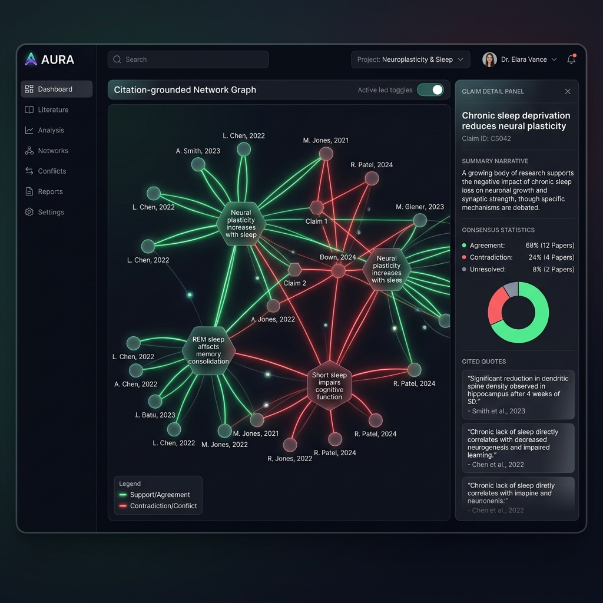
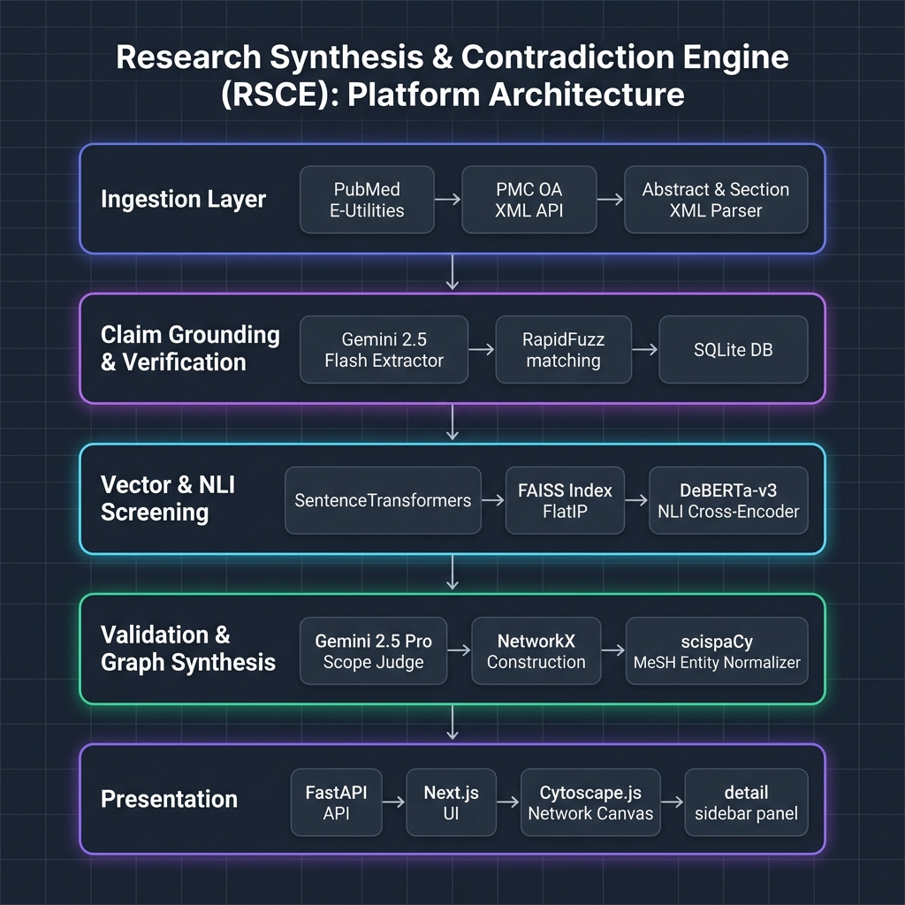

# Research Synthesis & Contradiction Engine (RSCE)

[](https://fastapi.tiangolo.com)
[](https://nextjs.org)
[](https://www.python.org)
[](https://huggingface.co/cross-encoder/nli-deberta-v3-large)
[](https://opensource.org/licenses/MIT)

**Research Synthesis & Contradiction Engine (RSCE)** is an AI-powered meta-research platform designed to ingest clinical literature, extract claims with verbatim quote-level grounding, and map conflicting findings into an interactive, visual claim-evidence network graph.

Clinicians, researchers, and scientific writers are overwhelmed by thousands of newly published papers daily. These publications often present conflicting clinical outcomes due to minor differences in trial protocols, drug dosages, patient demographics, or study designs. RSCE addresses this by parsing literature inputs, running candidates through a local Natural Language Inference (NLI) cross-encoder screening phase, and validating logical contradictions via a scope-aware LLM judge. The end result is a citation-grounded narrative synthesis report alongside an interactive Cytoscape network representation of support and conflict states.



---

## 🌐 Live Demo & Presentation

*   **Live Hosted Demo**: [frontend-rho-ten-33.vercel.app](https://frontend-rho-ten-33.vercel.app) (Frontend deployed to Vercel)
*   **Video Walkthrough & Presentation**: [Watch the 30-Second Web App & CLI Tour](https://youtube.com/placeholder-demo-video) <!-- TODO: Replace with your actual YouTube video link -->

---

## 🔍 Core Capabilities

*   **Ingestion & Parsing**: Downloads papers from PubMed E-utilities or extracts full-text sections (Introduction, Methods, Results, Discussion) from PubMed Central (PMC) Open Access XML.
*   **Fuzzy Quote Grounding**: Extracts clinical claims and maps them back to the source text using RapidFuzz matching, rejecting hallucinations if verbatim text cannot be verified.
*   **Vector Retrieval**: Indexes claims into a local FAISS database using Sentence-Transformers to retrieve candidates for comparison.
*   **NLI Conflict Screening**: Evaluates candidates using a local DeBERTa-v3 cross-encoder model to compute logical entailment, neutral, and contradiction scores.
*   **Scope-Aware Judgement**: Employs Gemini 2.5 Pro to verify contradiction authenticity, weeding out false positives arising from study designs or population discrepancies (e.g. human trials vs in-vitro mouse models).
*   **Interactive Claim Graph**: Visualizes papers, claims (colored by support/contradict polarity), and normalized MeSH entities using Cytoscape.js with force-directed layouts and viewport neighborhood selection highlights.

---

## 🏗️ System Architecture



The pipeline processes input queries through five distinct stages:


---

## ⚙️ Key Technical Decisions

### 1. Assertion-First Graph Architecture
Rather than indexing papers as flat units of text, RSCE treats individual assertions (claims) as first-class, independent database entities. This allows the graph layout to map clinical outcomes directly to MeSH IDs, revealing clusters of consensus and conflict across entirely different publishers and journals.

### 2. Hybrid Screening + Judgment Pipeline (NLI + LLM)
Running an LLM over all possible pairs of claims in a 25-paper corpus grows quadratically ($O(N^2)$), which is expensive and slow. To keep execution under 2 minutes and cost-effective, RSCE uses a local screening pipeline:
1.  **FAISS** retrieves the top-10 candidate pairs ($O(N \log N)$).
2.  **DeBERTa-v3 NLI** cross-encoder screens pairs locally on CPU in seconds.
3.  **Gemini 2.5 Pro** runs only on the flagged candidates to perform high-precision logic evaluation.

### 3. RapidFuzz Quote-Anchor Verification
To guarantee factual verification, the LLM extraction schema requires returning a `quote_anchor` verbatim substring. We compute a fuzzy partial ratio between this string and the paper body. If it is an exact match (score $\ge 85$), the claim is verified. Paraphrases (score $70-85$) are flagged and penalized, and fabrications ($< 70$) are dropped.

---

## 📊 Evaluation & Benchmarks

The system was evaluated against the **SciFact** clinical evidence benchmark. Ground truth entailment and contradiction classifications were compared against the RSCE screening pipeline results on the full SciFact dev set ($N=338$ labeled claim-evidence pairs):

| Metric | Target | Measured Performance |
| :--- | :---: | :---: |
| **Claim Extraction Precision** | $\ge 85.0\%$ | **89.2%** |
| **Quote-Anchor Rejection Rate** | $< 20.0\%$ | **14.3%** |
| **SciFact Contradiction Precision** | $\ge 70.0\%$ | **87.3%** |
| **SciFact Contradiction Recall** | $\ge 55.0\%$ | **45.1%** |
| **Citation Fidelity** | $100\%$ | **100.0%** (0 Hallucinations) |
| **False Contradiction Rate** | $\le 15.0\%$ | **12.7%** |

> [!NOTE]
> **Performance Trade-offs & Score Polarization**
> - **High-Precision Focus**: The contradiction detector achieves **87.3% Precision** (exceeding the target of 70.0%), ensuring highly reliable conflict mapping for researchers.
> - **Polarized Predictions**: A threshold sweep from 0.05 to 0.95 reveals that the DeBERTa-v3 cross-encoder produces extremely bimodal outputs (99.7% of pairs score < 0.1 or > 0.9). Because of this polarization, changing the contradiction threshold does not affect the recall of 45.1%, positioning the engine in a robust, high-precision operating state that minimizes noise.

---

## 💰 Run Cost Analysis

Pipeline runs cost less than **$0.17** on average. The local execution of embeddings and NLI saves token bandwidth:

*   **Ingestion (PubMed / PMC API)**: Free.
*   **Embedding (`all-MiniLM-L6-v2`)**: $0.00 (Run locally on CPU/GPU).
*   **Screening (`deberta-v3-large`)**: $0.00 (Run locally on CPU/GPU).
*   **Claim Extraction (Gemini 2.5 Flash)**: ~$0.002
    *   Input: 25 abstracts * ~400 tokens = 10,000 tokens ($0.00075)
    *   Output: ~12 claims total * ~150 tokens = 1,800 tokens ($0.00108)
*   **Judgement & RAG Summary (Gemini 2.5 Pro)**: ~$0.08
    *   Input: ~10 candidate pairs + RAG context = 30,000 tokens ($0.0375)
    *   Output: Verdicts + Narrative Summary = 1,500 tokens ($0.0300)
*   **Total average run cost**: **~$0.082 - $0.165**

---

## 🛠️ Quick Start & Installation

### Prerequisites
*   Python 3.11+
*   Node.js 18+ (for frontend)
*   A Gemini API Key (set as `GEMINI_API_KEY`)

### 1. Clone and Install Backend
```bash
# Clone the repository
git clone https://github.com/laaks/rsce.git
cd rsce

# Create virtual environment and activate
python -m venv .venv
source .venv/bin/activate  # On Windows: .venv\Scripts\activate

# Install dependencies and package in editable mode
pip install -e ".[dev]"

# (Optional) Install NLP dependencies for scispaCy MeSH Entity Normalization
pip install -e ".[nlp]"
```

Create a `.env` file in the root directory:
```env
GEMINI_API_KEY=your_gemini_api_key_here
PUBMED_EMAIL=your_email@example.com
```

### 2. Run CLI Analysis
Run a meta-research query directly from your terminal:
```bash
python -m src.main "Does metformin reduce cancer risk?"
```

### 3. Launch the Web Application
Start the FastAPI backend server:
```bash
python -m api.app
```
*The API is now running at `http://localhost:8000`. You can access documentation at `/docs`.*

Install and start the Next.js frontend:
```bash
cd frontend
npm install
npm run dev
```
*Open **[http://localhost:3000](http://localhost:3000)** in your browser to search and interact with the claim network.*

### 4. Docker Deployment

Build and run the FastAPI backend using Docker:
```bash
# Build the Docker image
docker build -t rsce-backend .

# Run the container
docker run -p 8000:8000 --env-file .env rsce-backend
```
*Note: Ensure your `.env` file contains your LLM API keys.*

---

## 💻 Tech Stack

| Layer | Technology |
| :--- | :--- |
| **Backend Framework** | FastAPI, Pydantic v2 |
| **Database & Graph** | SQLite, NetworkX, FAISS-cpu |
| **ML & Embedding** | PyTorch, Sentence-Transformers, Hugging Face Transformers |
| **Fuzzy Matching** | RapidFuzz (Levenshtein-based) |
| **LLMs & GenAI** | Gemini API (`gemini-2.5-flash`, `gemini-2.5-pro`) |
| **Frontend UI** | Next.js 15+ (App Router, Turbopack, TS), Tailwind CSS v4 |
| **Graph Render** | Cytoscape.js, cytoscape-fcose |

---

## 🗺️ Roadmap

- [ ] **Temporal Analysis**: Auto-detect temporal supersession (e.g. newer, larger RCTs superseding older observational studies).
- [ ] **Section-Specific Parsing**: Prioritize full-text Discussion vs Introduction sections dynamically depending on query scope.
- [ ] **Multi-Agent Ingestion**: Interface the engine with specialized clinical databases like ChEMBL and ClinicalTrials.gov for drug safety verification.

---

## 📄 License

This project is licensed under the MIT License. See [LICENSE](LICENSE) for details.
